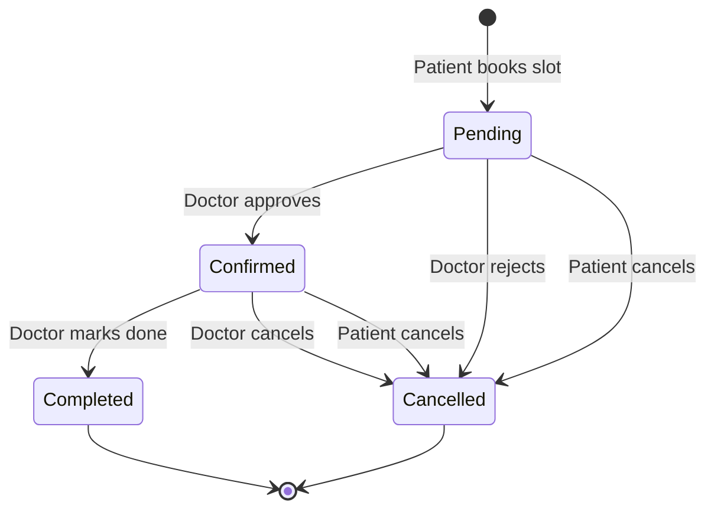

# Appointment State Machine

## States & Transitions



## Transition Rules

| From | To | Who | Notes |
|------|----|-----|-------|
| `Pending` | `Confirmed` | Doctor | Slot is locked |
| `Pending` | `Cancelled` | Doctor, Patient | Patient can only cancel own |
| `Confirmed` | `Completed` | Doctor | Marks visit done |
| `Confirmed` | `Cancelled` | Doctor, Patient | Only before completion |

## Validation Logic

```python
VALID_TRANSITIONS = {
    "Pending": ["Confirmed", "Cancelled"],
    "Confirmed": ["Completed", "Cancelled"],
    "Completed": [],
    "Cancelled": [],
}

ALLOWED_ROLES = {
    ("Pending", "Confirmed"): ["doctor"],
    ("Pending", "Cancelled"): ["doctor", "patient"],
    ("Confirmed", "Completed"): ["doctor"],
    ("Confirmed", "Cancelled"): ["doctor", "patient"],
}
```
